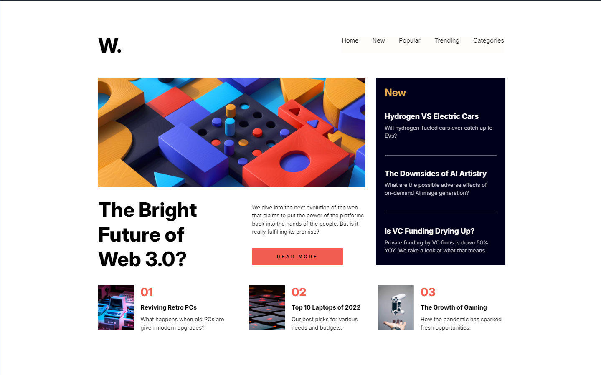
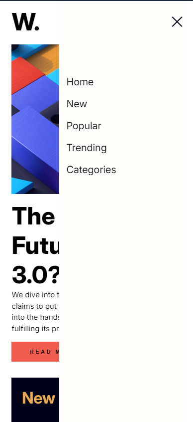
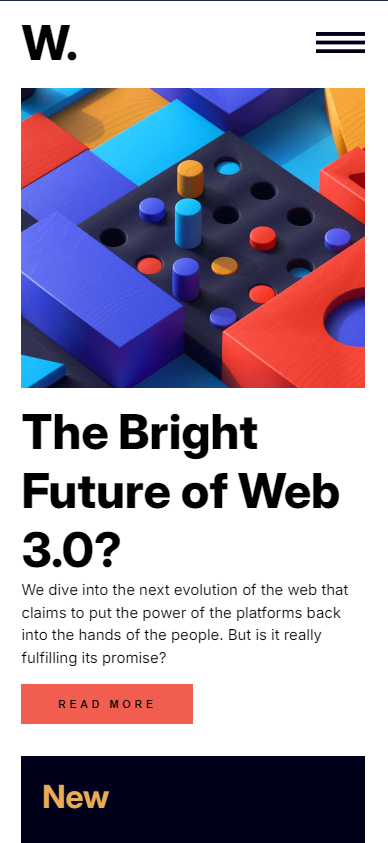
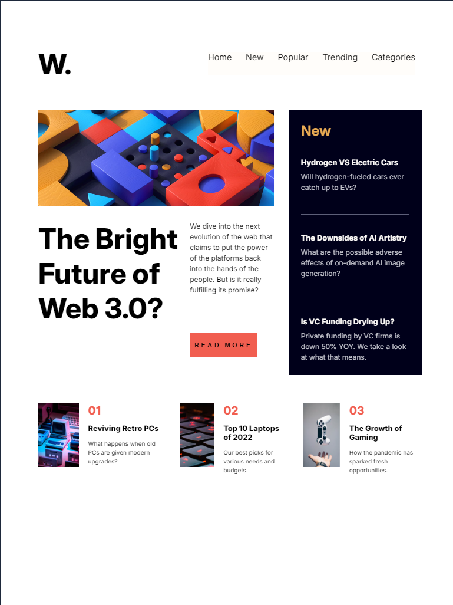

# Frontend Mentor - News homepage solution

This is a solution to the [News homepage challenge on Frontend Mentor](https://www.frontendmentor.io/challenges/news-homepage-H6SWTa1MFl). Frontend Mentor challenges help you improve your coding skills by building realistic projects.

## Table of contents

- [Overview](#overview)
  - [The challenge](#the-challenge)
  - [Screenshot](#screenshot)
  - [Links](#links)
- [My process](#my-process)
  - [Built with](#built-with)
  - [What I learned](#what-i-learned)
  - [Useful resources](#useful-resources)

## Overview

### The challenge

Users should be able to:

- View the optimal layout for the interface depending on their device's screen size
- See hover and focus states for all interactive elements on the page

### Screenshot

- Desktop design
  

- Mobile design menu
  

- Mobile design
  

- Tablet design
  

### Links

- Solution URL: [Add solution URL here](https://github.com/tortiman/news_homepage)
- Live Site URL: [Add live site URL here](https://tortiman.github.io/news_homepage/)

## My process

### Built with

- Semantic HTML5 markup
- CSS custom properties
- Flexbox
- Mobile-first workflow

### What I learned

I keep learning how to do responsive design, web accesibility, semantic HTML5 markup, mobile-first workflow and javascript.

```html
<body>
  <main>
    <header>
      <h1>W.</h1>
      <nav id="menu" class="menu-mobile">
        <ul class="list">
          <li>Home</li>
          <li>New</li>
          <li>Popular</li>
          <li>Trending</li>
          <li>Categories</li>
        </ul>
      </nav>
      
    </header>
    <div role="contentinfo" class="main-news">
      <section class="principal-new">
        
        <div class="new-body-principal">
          <h2>The Bright Future of Web 3.0?</h2>
          <div class="paragragh-button">
            <p>
              We dive into the next evolution of the web that claims to put the
              power of the platforms back into the hands of the people. But is
              it really fulfilling its promise?
            </p>
            <button>READ MORE</button>
          </div>
        </div>
      </section>
      <section class="news">
        <h3>New</h3>
        <article>
          <h4>Hydrogen VS Electric Cars</h4>
          <p>Will hydrogen-fueled cars ever catch up to EVs?</p>
        </article>
        <article>
          <h4>The Downsides of AI Artistry</h4>
          <p>
            What are the possible adverse effects of on-demand AI image
            generation?
          </p>
        </article>
        <article>
          <h4>Is VC Funding Drying Up?</h4>
          <p>
            Private funding by VC firms is down 50% YOY. We take a look at what
            that means.
          </p>
        </article>
      </section>
    </div>
    <footer>
      <article>
        <div class="img-article">
          
          <div class="news-footer">
            <span>01</span>
            <h5>Reviving Retro PCs</h5>
            <p>What happens when old PCs are given modern upgrades?</p>
          </div>
        </div>
      </article>
      <article>
        <div class="img-article">
          
          <div class="news-footer">
            <span>02</span>
            <h5>Top 10 Laptops of 2022</h5>
            <p>Our best picks for various needs and budgets.</p>
          </div>
        </div>
      </article>
      <article>
        <div class="img-article">
          
          <div class="news-footer">
            <span>03</span>
            <h5>The Growth of Gaming</h5>
            <p>How the pandemic has sparked fresh opportunities.</p>
          </div>
        </div>
      </article>
    </footer>
  </main>
</body>
```

```js
document.addEventListener("DOMContentLoaded", () => {
  console.log("script cargado");
  const iconMenu = document.getElementById("icon-menu");
  const menuMobile = document.querySelector(".menu-mobile");

  iconMenu.addEventListener("click", () => {
    console.log("click en icon-menu");
    menuMobile.classList.toggle("open");
    iconMenu.classList.toggle("open");
  });
});
```

### Useful resources

- [Example resource 1](https://responsively.app/) - This helped me for responsive design.
